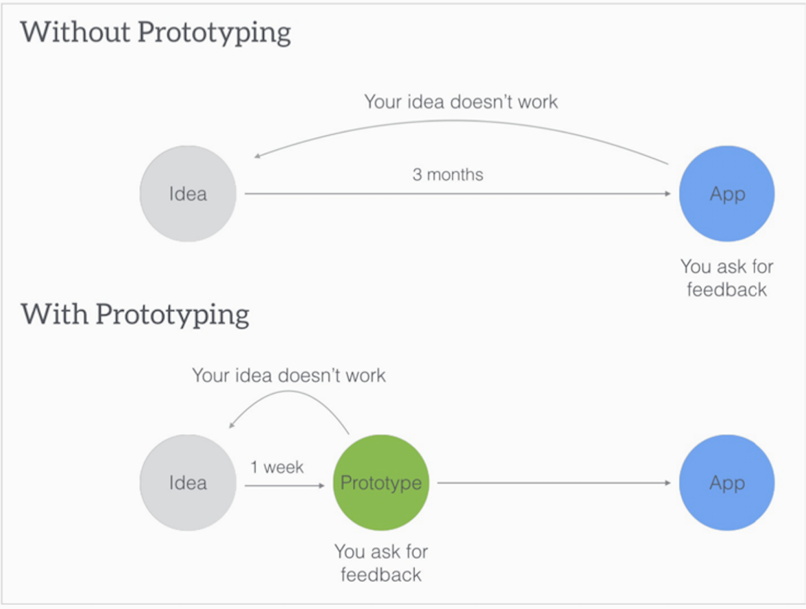
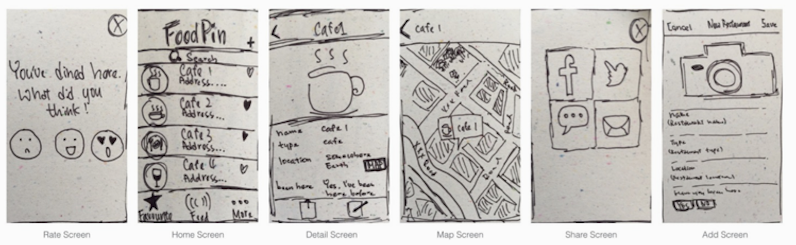
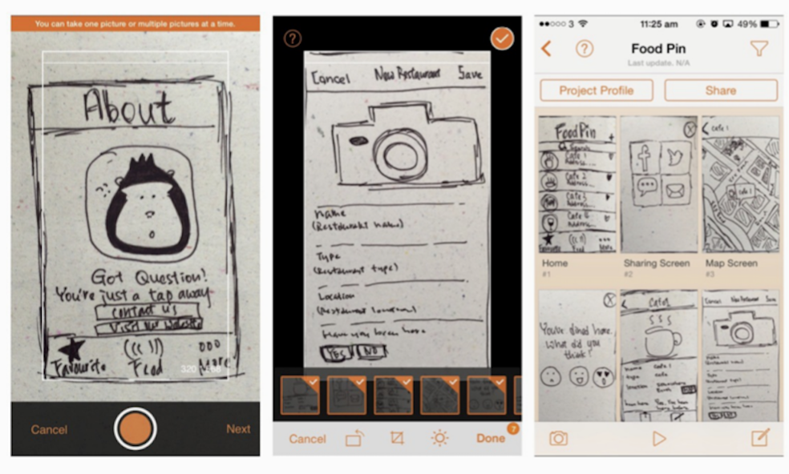
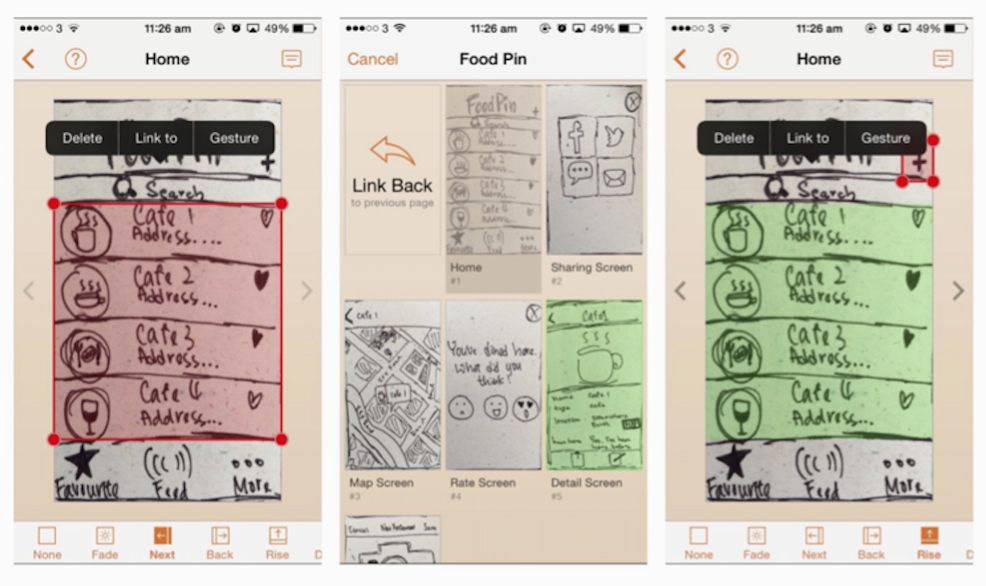
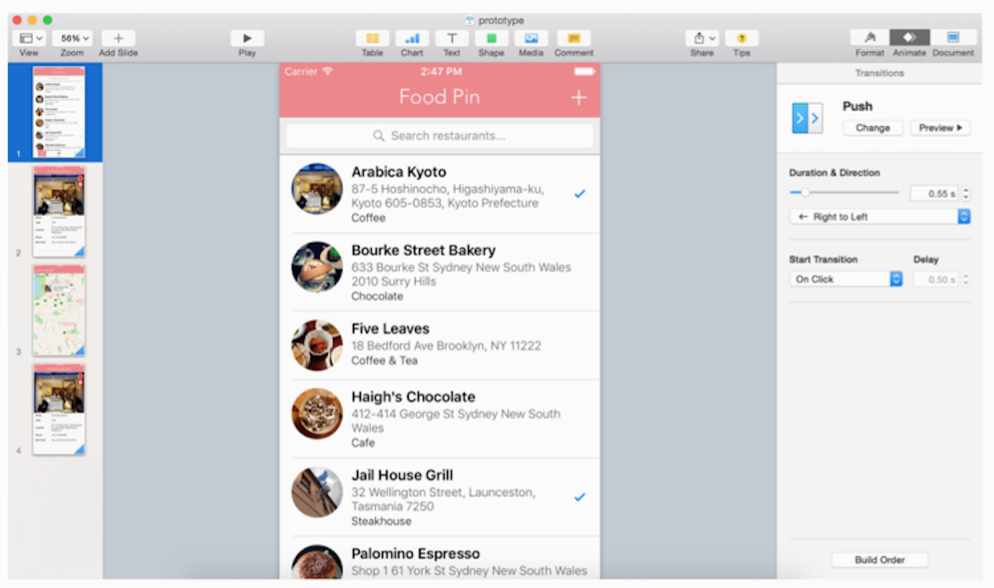
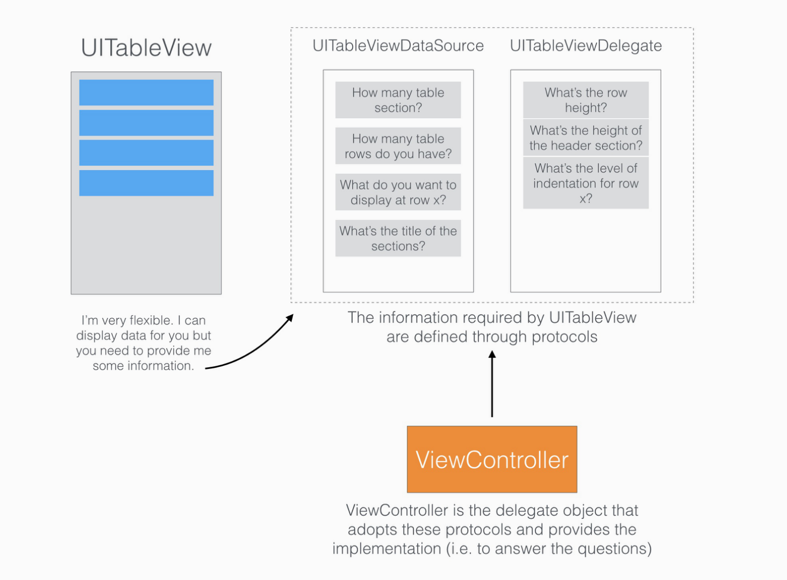

# Swift 讀書會 Week 3
- Chp 7 寫程式前的規劃(App原型設計)
- Chp 8 建立一個簡單的表格App
---

## What's prototype?
1. 可以驗證並視覺化Idea的早期模型
2. 核心功能要可以展示出來

---

## Why prototype?
- 用來溝通
- 跟團隊成員、客戶、測試人員

---
# 先在紙上畫草圖吧

- [這裏可以免費下載草稿紙](https://popapp.in/sketchpad/)
---

---

## 使用POP來Prototyping
---

- [POP的下載連結](https://itunes.apple.com/tw/app/pop-prototyping-on-paper./id555647796?mt=8)

---
- [POP的網站](https://popapp.in)

---
## Hifi Prototyping：使用Pages

- [keynotopia網站](http://keynotopia.com)

---
## Hifi Prototyping：使用Framejs

- [framejs網站](http://framerjs.com/gallery/)

---

# 創建簡單的表格APP Demo - 1

- 拉UI

- https://youtu.be/Lv1Q8IFlS88

---
# Datasource 與 delegate

---
# 創建簡單的表格APP Demo - 2

- 整合資料及Controller

- https://youtu.be/8sL4embvQEQ

---
template: inverse
# 謝謝大家
## John Liu
## twitter: @johnliu33

